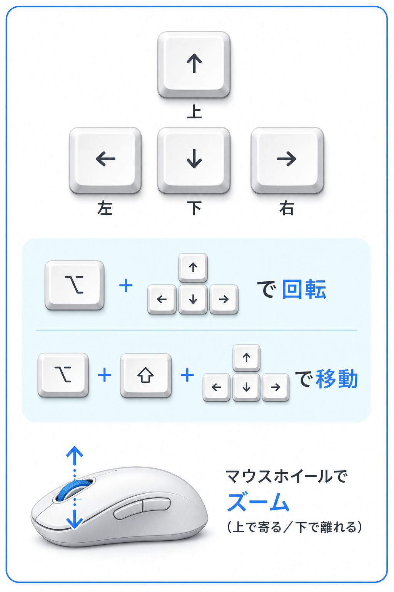

# VrmAiFriend

VRM キャラクターと Gemini Live でリアルタイム会話ができるデスクトップコンパニオンです。  
AI の応答は **Aivis Speech** で音声合成して再生します。会話からダンスを踊らせたり、ポーズさせたりできます。会話のトーンに合わせて **表情が滑らかに変わり**、積み重ねで **好感度** も変化します。

## インストール

起動前に、以下を用意してください。

| 項目                    | 内容                                                                                                                                                                    |
| ----------------------- | ----------------------------------------------------------------------------------------------------------------------------------------------------------------------- |
| **Aivis Speech Engine** | 音声合成に必須。PC にインストールし、起動しておく（既定: `http://127.0.0.1:10101`）。[AivisSpeech Engine](https://github.com/Aivis-Project/AivisSpeech-Engine) を参照。 |
| **Gemini API キー**     | メニューの **設定** タブで入力・保存する。`~/.env` の `GEMINI_API_KEY` がある場合は初回に取り込まれる。                                                                 |

> **注意:** Gemini API キーが未設定、または無効な場合、Gemini Live に接続できず **会話できません**。

メニューの **設定** タブで **Aivis Speech** の接続状態を確認できます。  
**Aivis Speech を起動してください** と出る場合は、Aivis Speech Engine を起動してから **音声** タブの「Aivis 一覧を更新」を押してください。

## 使い方

1. Aivis Speech Engine を起動する。
2. アプリを起動する。
3. メニューの **設定** タブで Gemini API キーを入力し **API キーを保存** する（未設定の場合）。
4. マイクに向かって話す（起動時に Gemini Live へ自動接続）。
5. AI の応答が Aivis Speech で音声合成され、口パクとともに再生される。

AI が話している最中もマイク送信は継続される。スピーカー利用時は **マイク感度調整** 後、大きな声で割り込める。

### メニュー操作

`ESC` キーでメニューとウィンドウの透明表示を切り替えられる。左上の **▲** でメニューを折りたためる。

| タブ | 主な内容 |
| ---- | -------- |
| **設定** | Gemini API キーの保存、Gemini Live・VRoid Hub・Aivis Speech の接続状態 |
| **モデル** | 同梱モデルへの復帰、VRoid Hub からハートしたモデルを読み込み |
| **キャラ** | 名前・性格の編集と保存、記憶の確認・削除 |
| **音声** | 話者・スタイルの選択、マイク感度調整、Aivis の起動 |
| **話題** | AI 主導トーク（無会話時に話題を振る）の設定 |
| **感情** | 現在の表情・好感度の表示、好感度のリセット |
| **カメラ** | 操作ガイド（図）・現在値・リセット |
| **About** | バージョン、サポートページ、ヘルプ |

**設定**

- **API キーを保存** — Gemini API キーを暗号化して保存（会話・記憶の整理で使用）
- **Gemini Live** — モデル名と接続状態
- **VRoid Hub / Aivis Speech** — 各サービスの接続状態

**モデル（VRoid Hub）**

- **モデルを初期値に戻す** — 同梱モデル（Sample）に戻す
- **ハートしたモデルを表示** — ログインし、ハートしたモデル一覧を取得
- 一覧からモデルを選び、利用条件に同意後に VRM を読み込む
- **クレジット表記** — 現在の Hub モデルのクレジットを表示
- **VRoid Hubを開く** — ブラウザで VRoid Hub を開く

**キャラ**

- あなたの名前・AI の名前・性別・年齢・その他指示、性格パラメータ（**1〜5 段階**）を編集
- Gemini 未接続時も、保存済みの設定を表示・編集できる
- **保存** — キャラ設定を保存し、会話に反映（接続中は再接続）
- **キャラを初期値に戻す** — 名前・性格を既定値に戻す（**記憶は残る**）
- **記憶を見る** — 覚えている内容をダイアログで確認
- **記憶を削除** — 確認後に記憶を消去

**話題（AI 主導トーク）**

- **AI 主導トーク** — 無会話中に短い話題を能動的に振る（マウスが動いているときなど）
- **無会話時間（分）** — 直近の会話から何分空いたら開始するか
- **話題（チェック） / 追加トピック** — 送る話題の選択
- **保存** — 設定を永続化
- **話題を初期値に戻す** — 話題設定を既定値に戻す

**感情**

- **現在の表情** — 会話・タッチで適用中の表情名を表示
- **好感度** — 0〜100 のメーター（会話の感情に応じて変動）
- **好感度を初期値に戻す** — 好感度を 0 にリセット

**音声（Aivis Speech）**

- **音声レベル** — マイク入力のレベルメータ（調整済みなら閾値の赤い縦線を表示）
- **マイク感度調整** — スピーカー利用時のエコー対策用（未調整時は起動後に自動で 1 回実施）
- **Aivisを開く** — Aivis Speech Engine を起動
- **音声モデル** — サムネイル付き一覧から話者を選択（初回は「コハク」）
- **スタイル** — ノーマルなどの話し方を選択
- **Aivis 一覧を更新** — インストール済みモデル一覧を再取得
- **音声を初期値に戻す** — 話者・スタイルを既定値に戻す

選択した音声モデルとスタイルは次回起動時に復元される。  
スピーカーで聞く場合は **マイク感度調整** を行うと、AI の発話中でもエコーを遮断しつつ、大きな声で割り込める。ヘッドホン利用時は調整不要なことが多い。

**カメラ**

- 現在の高さ・チルト・左右・ズームを表示
- **カメラを初期値に戻す** — 既定のカメラ位置に戻す

**About**

- **透過（ESCキー）** — ウィンドウ透過のオン / オフ（メニュー上部にも表示）
- **サポートページ** — GitHub のリリースページを開く
- **ヘルプ** — 基本操作とキーバインドを表示

メニュー下部の **アプリを終了 (Quit)** でアプリを終了する。

各タブに **初期値に戻す** ボタンがあり、項目ごとにリセットできる（従来の About からの一括リセットは廃止）。

### ダンス

会話中に、ダンス名を話しかけるとキャラクターが踊ります。「ストップ」「やめて」などと言うと、ダンスやポーズを止められます。

| 例                           | ダンス             |
| ---------------------------- | ------------------ |
| 「コンコンダンスして」       | コンコンダンス     |
| 「超絶かわいい」「かわいい」 | 超絶かわいい       |
| 「キャラメルダンスして」     | キャラメルダンス   |
| 「ウマウマパラパラして」     | ウマウマパラパラ   |
| 「ダンスやめて」「ストップ」 | 停止               |

ダンス中にキャラクターをタッチすると停止できます。ダンス中もマウスで体の向きを調整できます。

### キャラクター操作

| 操作                   | 動作                                             |
| ---------------------- | ------------------------------------------------ |
| マウス移動             | 体・頭・目がカーソル方向を追う                   |
| `F` キー               | 視線追従を固定 / 解除                            |
| `P` キー               | ポーズ撮影モードの開始 / 終了                    |
| `Option` + スペース    | マイク送信のミュート切替                         |
| ドラッグ               | ウィンドウを移動                                 |
| クリック（頭・胸など） | タッチリアクション（表情・音声・アニメーション） |

会話中に AI がポーズモードを開始することもある。ポーズ中はマウスで体の向きを調整できる。

### 会話の表情と好感度

会話中、AI の返答のトーンに合わせてキャラクターの表情が **滑らかに** 変わります（happy / sad / angry / surprised / relaxed / neutral）。タッチリアクション中はタッチ側の表情が優先されます。

好感度は会話の感情が確定したタイミングで自動的に変動します（happy で +1、sad で −1 など）。段階が変わると、AI の口調・態度も更新されます。好感度が高いほど親しみを込めた口調になり、低いほど距離を置いた態度になります。

メニューの **感情** タブで現在の表情と好感度を確認できます。

### 記憶（長期記憶）

- 会話が途切れてから **約 10 分** 後に、記憶が自動で整理・保存される
- 覚えた内容は次回以降の会話に反映される
- **キャラ** タブの **記憶を見る** で内容を確認できる
- **記憶を削除** — 確認後に記憶を消去

### カメラ操作

メニューの **カメラ** タブにも、**メニュー操作** の **カメラ** に掲載した操作ガイド（図）を表示します。

| 操作              | 動作                          |
| ----------------- | ----------------------------- |
| `↑` / `↓`         | カメラの高さを下げる / 上げる |
| マウスホイール    | ズーム（上=寄る、下=離れる）  |
| `Cmd` + `↑` / `↓` | ズーム（上=寄る、下=離れる）  |
| `Option` + `E` / `Q` | 高さを上げる / 下げる     |
| `Option` + `R` / `F` | チルト（上を向く / 下を向く） |
| `Option` + `A` / `D` | 左右の向き                |
| `Option` + `W` / `S` | ズーム（前進 / 後退）     |

カメラの高さ・チルト・左右・ズームは次回起動時に復元される。**カメラ** タブの **カメラを初期値に戻す** で規定値に戻せる。

## 更新履歴

バージョンごとの変更点は [CHANGELOG.md](CHANGELOG.md) を参照してください。  
最新リリース（v0.7.0）の概要は [RELEASE_NOTES.md](RELEASE_NOTES.md) を参照してください。
