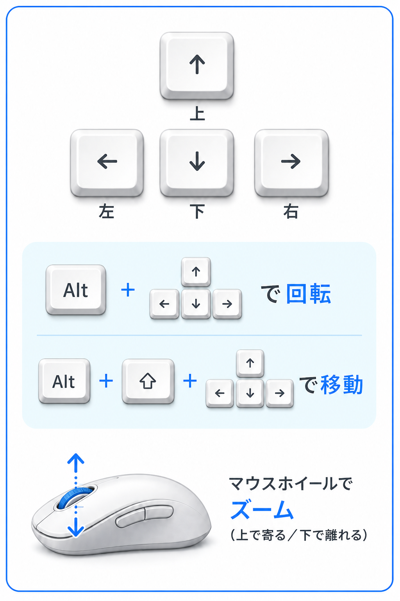

# VrmAiFriend

VRM キャラクターと Gemini Live でリアルタイム会話ができるデスクトップコンパニオンです。  
**Windows** / **macOS** に対応しています（Windows 対応は v0.8.0 以降）。  
AI の応答は **Aivis Speech** で音声合成して再生します。会話からダンスを踊らせたり、ポーズさせたりできます。タイマーや音楽操作、バッテリー確認などの声かけにも対応します。会話のトーンに合わせて **表情が滑らかに変わり**、積み重ねで **好感度** も変化します。

## 対応プラットフォーム

| プラットフォーム | 備考              |
| ---------------- | ----------------- |
| **Windows**      | v0.8.0 で新規対応 |
| **macOS**        | v0.7 以前から対応 |

## インストール

### 共通（Windows / macOS）

起動前に、以下を用意してください。

| 項目                    | 内容                                                                                                                                                                    |
| ----------------------- | ----------------------------------------------------------------------------------------------------------------------------------------------------------------------- |
| **Aivis Speech Engine** | 音声合成に必須。PC にインストールし、起動しておく（既定: `http://127.0.0.1:10101`）。[AivisSpeech Engine](https://github.com/Aivis-Project/AivisSpeech-Engine) を参照。 |
| **Gemini API キー**     | メニューの **設定** タブで入力・保存する。                                                                                                                              |
| **物理マイク**          | 必須。VB-Audio 等の仮想オーディオのみでは利用できません。                                                                                                               |

> **注意:** Gemini API キーが未設定、または無効な場合、Gemini Live に接続できず **会話できません**。

macOS では `~/.env` の `GEMINI_API_KEY` がある場合、初回に取り込まれます。

---

### Windows

#### 1. VrmAiFriend の入手と起動

1. [VrmAiFriend](https://github.com/aiharasoft-org/VrmAiFriend) から **Windows 版**（`.zip` など）をダウンロードする。
2. ZIP を展開し、フォルダ内の **実行ファイル（`.exe`）** を起動する。

> **セキュリティ警告について（重要）**  
> GitHub からダウンロードした Windows 版は、**Microsoft Defender SmartScreen** などにより、初回起動時に次のような警告が出る場合があります。
>
> - 「**Windows によって PC が保護されました**」
> - 「**不明な発行元** のアプリです」
>
> **これは未署名アプリによくある表示です。** 配布元を信頼できる場合のみ、次の手順で起動してください。
>
> **起動ダイアログで回避する場合**
>
> 1. 警告画面で **「詳細情報」** をクリックする。
> 2. **「実行」** をクリックする。
>
> **ダウンロード直後にブロックを解除する場合（推奨）**
>
> 1. ダウンロードした `.exe`（または ZIP 内の `.exe`）を右クリック → **プロパティ** を開く。
> 2. **全般** タブの **セキュリティ** に「**このファイルは他のコンピューターから取得したもので、コンピューターを保護するためにブロックされている可能性があります**」とある場合、**「ブロックの解除」** にチェックを入れる。
> 3. **OK** を押してから、再度 `.exe` を実行する。
>
> ブラウザ（Edge / Chrome 等）で「危険なファイル」と表示された場合も、信頼できる配布元であれば **保持** または **ダウンロードを続行** してください。  
> ウイルス対策ソフトが別途ブロックする場合は、そのソフトの **例外（許可）設定** で実行ファイルを許可してください。

#### 2. Aivis Speech（Windows）

- [AivisSpeech](https://github.com/Aivis-Project/AivisSpeech) 本体、または [AivisSpeech Engine](https://github.com/Aivis-Project/AivisSpeech-Engine) のいずれかをインストールする。
- 接続確認は **Engine の起動状態** を優先する（メニュー **設定** タブの **Aivis Speech**）。
- キャラタブの **音声** サブタブの **AivisSpeechを開く** から Windows 版を起動できる。

#### 3. マイク（Windows）

- **設定** タブの **マイク** が `OK` になることを確認する。
- VB-Audio Virtual Cable など **仮想オーディオだけ** が入っている PC では **物理マイクが見つかりません** と表示される。物理マイクを接続するか、**設定** → **システム** → **サウンド** → **入力** で実マイクを選ぶ。

---

### macOS

#### 1. VrmAiFriend の入手と起動

1. [VrmAiFriend](https://github.com/aiharasoft-org/VrmAiFriend) から **macOS 版** をダウンロードする。
2. `.app` を **アプリケーション** フォルダなどに置き、起動する。

> **初回起動で開けない場合**  
> 未署名アプリのため、Gatekeeper により「開発元を確認できない」と表示されることがあります。
>
> - `.app` を **Control + クリック**（または右クリック）→ **開く** → **開く** で起動する。
> - または **システム設定** → **プライバシーとセキュリティ** → **このまま開く** を選ぶ。

#### 2. Aivis Speech（macOS）

- [AivisSpeech Engine](https://github.com/Aivis-Project/AivisSpeech-Engine) をインストールし、起動しておく。
- 初回起動時に **マイク** の OS 権限を許可する。

#### 3. マイク（macOS）

- **設定** タブの **マイク** が `OK` になることを確認する。
- **システム設定** → **プライバシーとセキュリティ** → **マイク** で VrmAiFriend を許可する。

---

### 起動前の確認

メニューの **設定** タブで **Gemini Live**・**VRoid Hub**・**マイク**・**Aivis Speech** の接続状態を確認できます。  
**Aivis Speech を起動してください** と出る場合は、Aivis Speech Engine を起動してから **キャラ** タブの **音声** サブタブで「音声モデルを更新」を押してください。

## 使い方

1. Aivis Speech Engine を起動する（未インストール・未起動のときは、アプリ側の音声案内に従ってください）。
2. アプリを起動する。
3. メニューの **設定** タブで Gemini API キーを入力し **API キーを保存** する（未設定の場合。**Gemini AI Studioを開く** から取得ページを開ける）。
4. 準備に問題があると、短い音声で知らせる（Aivis のインストール／起動、AI 未接続、マイクなし、VRoid Hub 復元失敗など）。問題がなければ、キャラクターが短い挨拶をする（言い回しは毎回変わる）。
5. マイクに向かって話す（起動時に Gemini Live へ自動接続）。
6. AI の応答が Aivis Speech で音声合成され、口パクとともに再生される。

AI が話している最中もマイク送信は継続される。スピーカー利用時は **マイク感度を調整** 後、大きな声で割り込める。  
会話のつなぎ直しを待っているあいだは、キャラが待機ポーズをとることがあります。

### メニュー操作

`ESC` キーでメニューとウィンドウの透明表示を切り替えられる。左上の **▲** でメニューを折りたためる。

| タブ       | 主な内容                                                                           |
| ---------- | ---------------------------------------------------------------------------------- |
| **設定**   | Gemini API キーの保存、Gemini Live・VRoid Hub・**マイク**（状態・感度調整・音声レベル）・Aivis Speech（接続状態・**声の音量**） |
| **キャラ** | キャラセット・基本設定／モデル／音声／性格／感情／記憶の編集                       |
| **会話**   | モード・AI 主導トーク・環境音ケア・話題・間隔・会話ログ                          |
| **カメラ** | マウストラック ON/OFF・操作ガイド（図）・リセット                                |
| **About**  | バージョン、ヘルプ（GitHub）                                                       |

**設定**

- **Gemini AI Studioを開く** — API キー取得ページをブラウザで開く
- **API キーを保存** — Gemini API キーを暗号化して保存（会話・記憶の整理で使用）
- **Gemini Live** — モデル名と接続状態
- **VRoid Hub** — 接続状態
- **マイク** — 物理マイクの有無・権限・入力状態（`OK` / `準備完了` / `物理マイクが見つかりません` など）。状態の右に **マイク感度を調整**、下に **音声レベル** メーター
- **Aivis Speech** — 接続状態と **声の音量**（0〜100。スライダーで変更でき、次回起動時も復元）

**キャラ**

- **キャラセット** — 見た目・声・性格・記憶をまとめて呼出／新規作成／削除（初期キャラは削除不可）
  - **新しいキャラセット** — 今の見た目・声・性格に名前を付けて保存
  - **削除** — ユーザーセットを削除（初期キャラ選択時は非表示）
  - セットを切り替えると、そのセットの見た目・声・性格・記憶が読み込まれる
  - ユーザーセット選択中は、モデル／音声の変更や基本設定・性格の **適用** がそのセットに自動で保存される
- サブタブ: **基本設定** / **モデル** / **音声** / **性格** / **感情** / **記憶**
- **基本設定** — あなたの名前・AI の名前・性別・年齢・その他指示。**適用** で会話に反映。**初期値に戻す** あり
- **モデル** — VRoid Hub のハート一覧からの切替（選んだ時点で反映）。最下部の **初期値に戻す** で同梱モデルへ復帰
- **音声** — 音声モデル・スタイル・話速（変更はすぐ反映）
  - 上から: **音声モデル**（スタイル・話速を含む）→ **音声モデルを更新** → **AivisSpeechを開く** → **初期値に戻す**
  - **初期値に戻す** — 音声モデル・スタイル・話速（1.0）を既定値に戻す
- **性格** — 性格スライダー（**1〜5 段階**）。**適用** で会話に反映。**初期値に戻す** あり
- **感情** — 現在の表情と好感度メーターの表示。**好感度を初期値に戻す** でリセット
- **記憶** — **記憶を見る**、**記憶を削除**（キャラセットごとに分かれる）
- 基本設定または性格を変更したあと **適用** するまで会話には反映されない。未適用のままタブを離れる／メニューを閉じる／セットを切り替える／他アプリから戻ると確認が出る（生成中は「生成中です」と表示）

**会話**

- **モード** — 今の関わり方を選ぶ（変更はすぐ反映）。能動トークの有無はモードが決める
  - **雑談** — 短くテンポよく返す（能動あり）
  - **作業応援** — たまに声をかける（能動あり）
  - **お悩み相談** — じっくり聴く（能動トークなし）
  - **音楽鑑賞** — 曲の邪魔をせず短く返す（能動トークなし）
  - **集中** — 邪魔せず静かにする（能動トークなし）
  - 会話で「相談したい」「作業中」「音楽聴いてる」「集中したい」などと言っても同じように切り替わる
- **AI 主導トーク** — 現在のモードに合わせて表示（操作不可）
- **環境音で声をかける** — 作業応援モードのときだけ操作できる。ON にすると大きな音などの気配から「大丈夫？」などと短く声をかけることがある（既定 OFF。音の大きさだけをアプリ内で見る）
- **会話が途切れてから、声をかけるまでの間隔** — 雑談／作業応援それぞれ（既定は雑談 2 分・作業応援 5 分）。保存で永続化
- **話題（チェック） / 追加トピック** — 能動で振る話題の種類（モードでは変えない）
- **保存** — 会話タブの設定を永続化
- **会話を初期値に戻す** — 会話タブの設定を既定値に戻す
- **会話ログを見る** — 起動中のあなたと AI の発話内容を表示（能動トーク含む。アプリを終了すると消える）。**保存** でデスクトップにテキスト保存、消去も可

選択した音声モデルとスタイルは次回起動時に復元される。  
スピーカーで聞く場合は **設定** タブの **マイク感度を調整** を行うと、AI の発話中でもエコーを遮断しつつ、大きな声で割り込める。ヘッドホン利用時は調整不要なことが多い。物理マイク接続後は **設定** タブの **マイク** 状態が `OK` になることを確認してください。

#### Windows で音声合成が遅い場合（CPU モード）

Windows 版で Aivis Speech Engine を **CPU モード** で使っており、「少し遅いな」と感じる場合は、ユーザー間や公式で推奨されている以下の対策で、生成速度が **大幅に改善** することがあります。

**Windows の電源モードを「最適なパフォーマンス」にする**

1. **設定** を開く
2. **システム** → **電源**（または **電源とバッテリー**）へ進む
3. **電源モード** を **最適なパフォーマンス** に変更する

これにより、E コアに流れていた処理が P コア（高性能コア）へ適切に割り当てられやすくなり、音声合成が速くなることがあります。ノート PC では AC 電源接続時に設定できる場合が多いです。

### カメラ

メニューの **カメラ** タブに操作ガイド（図）を表示します（macOS: Option、Windows: Alt）。

- **マウストラック** — 体・頭・目のマウス追従の ON/OFF（既定 ON。設定は次回起動時も保持）
- **カメラを初期値に戻す** — 既定のカメラ位置に戻し、キャラも正面を向く

**About**

- **ヘルプ** — GitHub のプロジェクトページを開く

メニュー上部の **透過（ESC）** でウィンドウ透過のオン / オフ、その右の **終了** でアプリを終了できる（キャラが声で確認し、手を振ってから終了。会話は記憶用に保存される）。「バイバイ」「さようなら」などと話しても、確認のあと終了できる。

各タブに **初期値に戻す** ボタンがあり、項目ごとにリセットできる（従来の About からの一括リセットは廃止）。

### ダンス

会話中に、ダンス名を話しかけるとキャラクターが踊ります。ダンス中に話しかけてもダンスはそのまま続きます。止めたいときは「ストップ」「やめて」「音楽停止」などと言うか、キャラクターをタッチしてください。ポーズ撮影中に話しかけた場合は、ポーズは止まって会話を優先します。

| 例                           | ダンス           |
| ---------------------------- | ---------------- |
| 「コンコンダンスして」       | コンコンダンス   |
| 「超絶かわいい」「かわいい」 | 超絶かわいい     |
| 「キャラメルダンスして」     | キャラメルダンス |
| 「ウマウマパラパラして」     | ウマウマパラパラ |
| 「ダンスやめて」「ストップ」「音楽停止」 | ダンス・ポーズ・音楽の停止 |

### タイマー

「3分後に教えて」「タイマー5分」などと話すと、時間になったらアバターが声で知らせます。「明日の15時に教えて」「7月21日の10時に知らせて」のように日時を指定しても知らせます。複数の時刻を一度に頼むこともできます。知らせたあとにしばらく返事がないときは、もう一度だけ知らせます。「今のアラームは？」「アラーム消して」で確認や削除もできます（アプリ起動中のみ有効です）。

### 環境音での声かけ

**会話** タブの **環境音で声をかける** は作業応援モードのときだけ操作できます。ON にすると、急な大きな音やそのあとの静けさなどをきっかけに、「大丈夫？」「休憩する？」などと短く声をかけることがあります（既定は OFF）。音の大きさの変化だけをアプリ内で見ており、環境音そのものを解析のために外部へ送ることはありません。

### アプリ起動

「ブラウザ開いて」「メモ帳起動して」「電卓」「ファインダー／エクスプローラー」などと話すと、許可されたアプリだけを起動できます。

### バッテリー

「バッテリーどう？」「マウスの電池」などと聞くと、PC・マウス・キーボードの残量を答えます（取れない機器もあります）。残量が少なくなると、アバターが声で知らせます。

### メディア操作

「再生して」「止めて」「次の曲」「前の曲」「スキップ」などと話すと、Spotify や Music、ブラウザの動画など、いま再生中のメディアを操作できます（再生中のものが無いときは反応しないことがあります）。macOS では「シャッフル再生して」「ランダム再生」「シャッフルやめて」でシャッフルの ON／OFF もできます。「今何の曲？」「曲名教えて」「誰の歌？」と聞くと、Apple Music で再生中の曲名・アーティストを答えます。「カラオケのプレイリストを再生して」のように名前を指定すると、Music のプレイリストを探して再生します。アーティスト名だけを指定すると、どの曲にするか聞き返します。「全部」「すべて」などと答えると、ライブラリ内のそのアーティストの曲をまとめて再生します。曲名が曖昧なときも、確認してから再生することがあります。

**音量の言い分け**

| 意図 | 例 | 動作 |
| ---- | -- | ---- |
| 音楽の音量（macOS） | 「音量を50にして」「今の音量は？」「音楽の音量いくつ？」 | Music / Spotify の音量（0〜100）。アプリが起動していないときは操作できません |
| 声の音量（両方） | 「声の音量いくつ？」「声を大きくして」「あなたの音量を50に」 | キャラの声だけ（0〜100）。設定タブのスライダーでも変更できます |
| 曖昧な「音量」（Windows） | 「音量を40に」「今の音量は？」 | 声の音量として扱います（音楽アプリの音量は対象外） |

macOS では、初回に Music や Spotify の操作許可を求められたら許可してください。「再生して」と頼むと、Music / Spotify がまだ起動していなければ Music を起動してから再生を始めます。Windows では曲名・プレイリストの自動再生はできず、規定の音楽プレイヤーを開いて案内します。

### キャラクター操作

| 操作                   | macOS               | Windows          | 動作                                             |
| ---------------------- | ------------------- | ---------------- | ------------------------------------------------ |
| マウス移動             | —                   | —                | 体・頭・目が追従（頭は下向きのみ。カメラタブで OFF 可） |
| `F` キー               | —                   | —                | 視線追従を固定 / 解除                            |
| `P` キー               | —                   | —                | ポーズ撮影モードの開始 / 終了                    |
| ミュート               | `Option` + `M`      | `Alt` + `M`      | マイク送信のミュート切替（ミュート中は画面中央下に「Mute」） |
| ドラッグ               | —                   | —                | ウィンドウを移動                                 |
| クリック（頭・胸など） | —                   | —                | タッチリアクション（表情・音声・アニメーション） |

会話中に AI がポーズモードを開始することもある。

> **修飾キー:** macOS では `Option` / `Cmd`、Windows では `Alt` / `Ctrl` に読み替えてください（ヘルプ・カメラガイドも OS 別表示）。

### 会話の表情と好感度

会話中、AI の返答のトーンに合わせてキャラクターの表情が **滑らかに** 変わります（happy / sad / angry / surprised / relaxed / neutral）。タッチリアクション中はタッチ側の表情が優先されます。

好感度は会話の感情が確定したタイミングで自動的に変動します（happy で +1、sad で −1 など）。段階が変わると、AI の口調・態度も更新されます。好感度が高いほど親しみを込めた口調になり、低いほど距離を置いた態度になります。

メニューの **キャラ** → **感情** で現在の表情と好感度を確認できます。

### 記憶（長期記憶）

- 会話が途切れてから **約 10 分** 後に、記憶が自動で整理・保存される
- 覚えた内容は次回以降の会話に反映される（キャラセットごとに分かれる）
- いつ頃の話かも覚え、「おととい」などと振り返ったり、日付や時刻を聞かれたら答えられることがある
- **キャラ** タブの **記憶** サブタブで **記憶を見る** と内容を確認できる
- **記憶を削除** — 確認後に、いま選んでいるキャラセットの記憶を消去

### カメラ操作

メニューの **カメラ** タブに、実行 OS に応じた操作ガイド（図）を表示します。

| 操作   | macOS                     | Windows                 | 動作                     |
| ------ | ------------------------- | ----------------------- | ------------------------ |
| 回転   | `Option` + 矢印           | `Alt` + 矢印            | VRM 中心に上下左右へ回る |
| 移動   | `Option` + `Shift` + 矢印 | `Alt` + `Shift` + 矢印  | 上下左右へ平行移動       |
| ズーム | マウスホイール            | 同左                    | 上=寄る、下=離れる       |

カメラの高さ・回転・左右シフト・ズームは次回起動時に復元される。**カメラ** タブの **カメラを初期値に戻す** で規定値に戻し、キャラも正面を向く。

## 更新履歴

バージョンごとの変更点は [CHANGELOG.md](CHANGELOG.md) を参照してください。  
最新リリース（v0.9.2）の概要は [RELEASE_NOTES.md](RELEASE_NOTES.md) を参照してください。